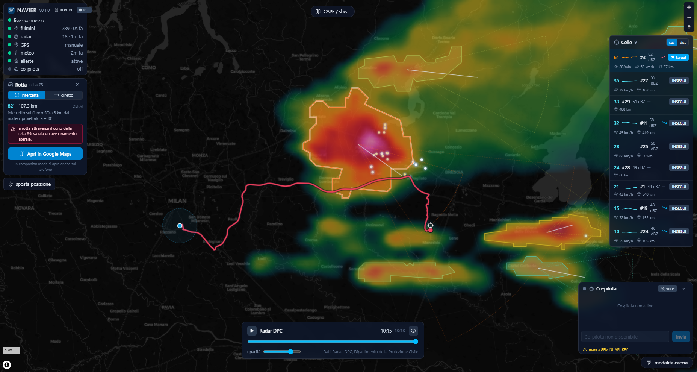

# NAVIER

NAVIER è un'applicazione di supporto allo storm chasing in Italia: nowcasting,
tracking delle celle temporalesche, allarmi di sicurezza deterministici e un
co-pilota AI vocale. Nasce come strumento per un equipaggio (chi guida più un
operatore/navigatore): la mappa vive su un laptop in auto, il telefono fa da sorgente
GPS, e il co-pilota commenta la situazione a voce mentre si è in movimento.

Gli allarmi critici (fulmini vicini, rischio nubifragio) sono deterministici e vengono pronunciati con
priorità assoluta; il co-pilota AI non li genera e non li può contraddire.


## Cosa fa

- **Radar** in tempo quasi reale dal mosaico VMI della Protezione Civile (DPC), con
  fallback automatico su RainViewer quando il dato DPC è vecchio.
- **Fulmini** live da Blitzortung, con clustering e rilevamento dei "lightning jump".
- **Tracking delle celle**: segmentazione dal grigliato dBZ, moto stimato, coni di
  previsione a +30 e +60 minuti, indice di severità ed euristica "possibile
  supercella" (una euristica, mai una certezza: non c'è radar Doppler).
- **Allarmi di sicurezza** deterministici (P1/P2/P3): fulmini vicini, rischio grandine,
  cella in avvicinamento, nubifragio, dato non aggiornato, e altri.
- **Co-pilota AI** (Google Gemini): risponde alle domande dell'operatore, spiega gli
  allarmi e, se attivato, commenta in modo proattivo l'evoluzione. Funziona solo con
  una chiave API; senza chiave l'app gira lo stesso e il co-pilota resta dormiente.
- **Voce in uscita**: sintesi vocale con la voce di sistema di Windows (SAPI). Allarmi
  e co-pilota parlano da un'unica coda a priorità: un allarme P1 interrompe tutto.
- **Voce in ingresso**: push-to-talk. Si preme la barra spaziatrice sulla mappa, parte
  un beep, si pronuncia una frase, viene trascritta (Google STT gratuito) e girata al
  co-pilota. Nessuna parola di attivazione: l'ascolto parte solo su richiesta.
- **Navigazione**: calcolo di un percorso verso una cella o verso un punto di
  intercetto scelto sul fianco d'inflow, agganciato alla rete stradale e accompagnato
  dal verdetto di fattibilità (se ci arrivi prima della cella), con hand-off a Google
  Maps sul telefono.
- **Qualità della vista**: il punto di intercetto viene scelto anche in base a cosa si
  vedrà davvero da lì. La linea di vista verso la cella viene percorsa sul grigliato SRI
  per misurare quanta pioggia si frappone, e la posizione del sole (calcolata, nessuna
  sorgente esterna) dice se la cella sarà controluce o illuminata. Il terreno non è
  ancora considerato.
- **Pianificazione**: heatmap di CAPE/shear (Open-Meteo, modello ICON-2I) e outlook
  convettivi PRETEMP + ESTOFEX; bollettini di criticità ufficiali DPC come overlay.
- **Registrazione e replay** delle sessioni per la revisione post-caccia.
- **Companion telefono**: pagina web separata che invia il GPS del telefono alla mappa.
- **Mappa offline** opzionale (archivio PMTiles) per continuare a funzionare senza rete.

## Architettura

Il progetto ha due parti:

- **`backend/`**: server Python (FastAPI + WebSocket). Raccoglie i dati dalle sorgenti
  (`app/ingest/`), li elabora (`app/processing/`), valuta gli allarmi (`app/alerts/`),
  costruisce lo stato del mondo e lo trasmette ai client via WebSocket. Contiene anche
  il co-pilota (`app/copilot/`), la voce in uscita (`app/tts/`) e la voce in ingresso
  push-to-talk (`app/stt/`).
- **`frontend/`**: interfaccia web (React + Vite + MapLibre GL). Disegna la mappa, i
  pannelli di stato, la lista delle celle, la chat del co-pilota e i controlli. Si
  connette al backend via WebSocket (`/ws/live`) e via REST (`/api/...`).

In produzione il frontend viene compilato dentro `backend/app/static_dist/` e servito
dallo stesso backend: si apre un'unica pagina su `http://localhost:5700/`.

## Requisiti

- **Windows** (la sintesi vocale usa `System.Speech` via PowerShell e il beep usa
  `winsound`; il resto è portabile, ma la voce è pensata per Windows).
- **Python 3.11+**.
- **Node.js + npm** (per compilare il frontend).
- Un **microfono** e casse/cuffie per la parte vocale.
- Facoltativo: una **chiave API Google Gemini** per il co-pilota
  (https://aistudio.google.com).

## Installazione

### Prerequisiti: Python e Node.js

Se Python e Node.js non sono già installati, la via più rapida su Windows 10/11 è
`winget`, da PowerShell:

```
winget install Python.Python.3.12
winget install OpenJS.NodeJS.LTS
```

In alternativa si scaricano gli installer da python.org/downloads e da nodejs.org
(versione LTS). Due avvertenze sull'installer di Python: va spuntata la casella
**"Add python.exe to PATH"** nella prima schermata, altrimenti i comandi qui sotto non
vengono trovati; e conviene restare su **Python 3.12**, perché per le versioni appena
uscite le ruote precompilate di numpy, scipy e rasterio per Windows a volte non ci sono
ancora e l'installazione fallisce provando a compilare da sorgente. npm è incluso in
Node.js e non va installato a parte.

Si chiude e si riapre il terminale, poi si verifica:

```
python --version
node --version
npm --version
```

Servono Python 3.11 o superiore e Node 18 o superiore.

Se `python --version` apre il Microsoft Store invece di rispondere, sono gli alias di
esecuzione di Windows: **Impostazioni → App → Impostazioni avanzate delle app → Alias di
esecuzione app**, si disattivano `python.exe` e `python3.exe`.

### Backend

Dalla cartella `backend/` si crea un ambiente virtuale e si installano le dipendenze
con gli extra necessari:

```
cd backend
python -m venv .venv
.venv\Scripts\activate
pip install -e ".[processing,copilot,voice]"
```

Gli extra:

- `processing`: stack numerico/geo per radar e tracking (numpy, scipy, shapely, ...).
- `copilot`: SDK Google Gemini per il co-pilota.
- `voice`: riproduzione audio e cattura del microfono (sounddevice, SpeechRecognition).
  Serve per la voce in uscita e in ingresso.

### Frontend

Dalla cartella `frontend/`:

```
cd frontend
npm install
```

## Configurazione

Si copia `.env.example` in `.env` e si compila quanto serve (il file `.env` non viene
versionato). Le voci principali:

- `GEMINI_API_KEY`: chiave per il co-pilota. Senza, il co-pilota resta dormiente.
- `ENABLE_TTS`: voce in uscita (voce di sistema Windows). `TTS_VOICE` e `TTS_RATE`
  scelgono voce e velocità; vuoto = una voce italiana installata, altrimenti la voce
  predefinita.
- `ENABLE_STT`: voce in ingresso push-to-talk (beep configurabile con `STT_BEEP_FREQ`
  e `STT_BEEP_MS`).
- Flag delle sorgenti (`ENABLE_DPC_RADAR`, `ENABLE_BLITZORTUNG`, `ENABLE_OPENMETEO`,
  `ENABLE_PRETEMP`, `ENABLE_DPC_ALLERTE`, ...) per accendere o spegnere i singoli feed.
- `PORT`: porta del backend (default 5700).

Tutti i parametri hanno un default sensato in `app/config.py`.

## Avvio

### Modo rapido (Windows)

Dalla cartella radice del progetto:

- `start.bat` compila il frontend la prima volta, avvia il backend in una finestra
  dedicata e apre l'app in Chrome su `http://localhost:5700/`.
- `stop.bat` ferma il backend; la scheda del browser non viene toccata.

### Modo manuale

Backend (dalla cartella `backend/`, con il venv attivo):

```
python -m app.main
```

Frontend in sviluppo (hot reload su `http://localhost:5173/`, dalla cartella
`frontend/`):

```
npm run dev
```

Per la build di produzione servita dal backend:

```
npm run build
```

## Uso della voce

- **Ascolto (push-to-talk)**: si preme la **barra spaziatrice** con la mappa a fuoco.
  Parte un beep, si pronuncia una frase (per esempio "quale cella conviene?"), il
  backend la trascrive e la gira al co-pilota, che risponde a voce. In alternativa si
  può usare il pulsante microfono nel pannello del co-pilota. La spaziatrice viene
  ignorata mentre si scrive in un campo di testo.
- **Voce in uscita**: allarmi e risposte del co-pilota vengono pronunciati dalla voce
  di sistema. Il pulsante di silenziamento nel banner degli allarmi zittisce la voce
  senza nascondere gli allarmi visivi.

## Companion telefono (GPS)

Il companion è una pagina che il telefono tiene aperta durante la caccia e che manda la
posizione GPS alla mappa del laptop.

Dalla cartella `frontend/` si avvia il server di sviluppo con `npm run dev`: resta in
ascolto anche sulla rete locale, non solo su localhost.

Serve poi l'indirizzo IP del laptop sulla rete locale. Da PowerShell:

```
(Get-NetIPConfiguration | Where-Object { $_.IPv4DefaultGateway }).IPv4Address.IPAddress
```

Risponde con un indirizzo solo, quello della scheda davvero collegata alla rete, e per
questo è più comodo di `ipconfig`, che elenca anche le schede virtuali di VPN, macchine
virtuali e WSL fra cui è facile sbagliare. L'indirizzo giusto comincia quasi sempre con
`192.168.` oppure `10.`, e cambia quando ci si sposta su un'altra rete.

Dal telefono, collegato alla stessa rete Wi-Fi, si apre:

```
http://<ip-del-laptop>:5173/companion
```

All'inizio il pulsante "Attiva GPS" è disattivato: i browser espongono la
geolocalizzazione solo in contesto sicuro, e un indirizzo IP in HTTP non lo è. Su Chrome
per Android si sistema una volta sola dichiarando quell'origine come sicura. Si apre

```
chrome://flags/#unsafely-treat-insecure-origin-as-secure
```

si incolla `http://<ip-del-laptop>:5173` nella casella, si porta il flag su *Enabled* e si
riavvia Chrome. Poi si tocca "Attiva GPS" e si concede il permesso di posizione.

Il pallino in alto diventa verde quando il collegamento è attivo e compare il contatore
degli invii; la pagina tiene acceso lo schermo da sola e va lasciata aperta durante la
caccia.

Cambiando rete cambia l'IP del laptop, quindi va aggiornata la voce nel flag. In
alternativa, chi preferisce non toccare i flag può servire il frontend in HTTPS: Vite lo
fa da solo se trova `frontend/certs/cert.pem` e `key.pem`, generabili con mkcert.

## Endpoint principali

- `GET /` : l'app (frontend compilato).
- `GET /companion` : pagina companion per il GPS del telefono.
- `WS /ws/live` : canale in tempo reale (stato del mondo, allarmi, radar, co-pilota).
- `GET /api/health` : stato del server.
- `GET /api/radar/frames`, `GET /api/planning`, `GET /api/allerte`, `GET /api/outlook`,
  `POST /api/route`, `GET /api/sessions`, `GET /api/copilot/status` : dati e comandi
  per i pannelli.

## Sorgenti dati

- Radar: mosaico VMI di Radar-DPC (Protezione Civile), fallback RainViewer.
- Fulmini: Blitzortung.
- Ambiente convettivo: Open-Meteo (ItaliaMeteo/ARPAE ICON-2I) per CAPE e shear.
- Prodotti DPC ausiliari: POH (probabilità di grandine) e SRI (intensità di pioggia).
- Outlook: PRETEMP e ESTOFEX. Bollettini di criticità ufficiali DPC.

Tutte le richieste rispettano le sorgenti (polling gentile, User-Agent identificativo).
I dati non vengono ri-ospitati: si mostrano con la loro attribuzione.

## Struttura del repository

```
backend/
  app/
    ingest/       sorgenti dati (radar, fulmini, meteo, outlook, allerte, GPS)
    processing/   grigliati radar, tracking celle, clustering fulmini, stato del mondo
    alerts/       regole e motore degli allarmi deterministici
    copilot/      co-pilota Gemini (prompt, budget, snapshot, servizio)
    tts/          voce in uscita (voce di sistema Windows + player)
    stt/          voce in ingresso push-to-talk (beep + Google STT)
    routing/      calcolo percorsi e punto di intercetto
    store/        stato in memoria, registrazione e replay delle sessioni
    api/          endpoint REST, WebSocket, file statici
  tests/          test della suite
frontend/
  src/
    map/          layer e stile della mappa MapLibre
    panels/       pannelli UI (stato, celle, allarmi, co-pilota, radar, ...)
    companion/    pagina GPS del telefono
    state/        store dell'app (zustand)
    lib/          client WebSocket, geo, navigazione
```

## Licenza

MIT. I metadati del pacchetto sono in `backend/pyproject.toml`.
